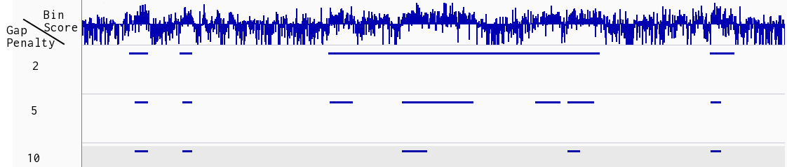

# EDD - Enriched Domain Detector

[EDD](http://nar.oxfordjournals.org/content/42/11/e92) is a ChIP-seq peak caller for detection of megabase domains of enrichment. 

## Installation Requirements
At the moment, EDD only supports **Python 2.7**. Please contact us if this is a problem for you.
The most CPU intensive parts of the algorithm have been written in Cython, which will be translated into C and compiled during installation. A consequence of this is that EDD has compile time dependencies on the following python packages: Cython, numpy and pysam. So these packages must be installed prior to installing EDD.

```bash
pip install Cython numpy pysam
```

Although EDD has explicitly listed dependencies that *setuptools* will try to resolve, we have encountered problems with the order that these dependencies are installed in. To work around this problem, install the following EDD dependencies prior to installing EDD:

```bash
pip install scipy
pip install pandas
pip install patsy
pip install statsmodels
```

EDD currently uses the pybedtools library that again requires the [bedtools](https://github.com/arq5x/bedtools2) program to be installed and on the path. See the [bedtools documentation for installation instructions](http://bedtools.readthedocs.org/en/latest/content/installation.html)

## Installation

The latest stable version of EDD can be installed using pip

```bash
pip install edd
```

The latest development version of EDD can be installed by running the following command from the source folder after downloading or checking out a new version:
```bash
python setup.py install
```


## Usage
All the required and optional arguments to EDD are listed here and further explained below
```
edd [-h] [--bin-size BIN_SIZE] [-n NUM_TRIALS] [-p NPROCS] [--fdr FDR] [-g GAP_PENALTY] [--config-file CONFIG_FILE] [--write-log-ratios] [--write-bin-scores] [-v]
```
### Required Arguments
* **chrom_size**:
  * This must be a tab separated file with two columns. 
  * The first column contains chromosome names and the second contains chromosome sizes.
  * Instructions on how to acquire such a file can be found in the *Additional* section below.
* **unalignable_regions**:
  * This must be a (possibly empty) bed file defining regions to be excluded from the analysis, such as telomeres, centromeres or other large repeat regions. 
  * Failure to include a proper file will increase the number of false positive domains detected in the analysis.
  * EDD will never detect a domain that spans an unalignable region. 
  * Instructions on how to acquire such a file can be found in the *Additional* section below.
* **ip_bam**: a bam file containing aligned ChIP sequences
* **input_bam**: a bam file containing aligned Input sequences
* **output_dir**: Path to output directory for files created by EDD. Will be created if not existing. The output directory is expected to be unique to the analysis. (e.g. *peaks/HSF_LMNA_rep1* and not just *peaks*)

### Optional Arguments
* --bin-size
 * Bin size is auto-estimated if left blank (recommended), but can also be overridden.
 * The argument must be an integer specifying the bin size in Kb.
* -n --num-trials, by default 10,000
 * Number of Monte Carlo trials
* -p --nprocs
 * Number of processes to use for Monte Carlo simulation, by default 4.
 * Can be increased if your computer has many cores.
 * e.g. set this to 32 if you have 32 cores as this will reduce the running time.
* --fdr, by default 0.05
 * Significance threshold for peak calling
* -g --gap-penalty
 * Auto estimated if no value is specified
 * Adjusts how sensitive EDD is to heterogeneity within domains. 
 * Depends on Signal/Noise ratio of source files and on the interests of the researcher. 
  * A lower value favors large enriched domains with more heterogeneity. 
  * A higher value favors smaller enriched domains devoid of heterogeneity.
  * More information and examples can be found in the *Additional*
    section below.
* --config-file
 * Path to user specified EDD configuration file
 * Please see section on *Configuring EDD* below.
* --write-log-ratios
  * Write log ratios as a bedgraph file in the output folder
* --write-bin-scores
  * Write bin scores as a bedgraph file in the output folder

## Output Files
EDD creates three files in the output directory. 
* A bed file with peaks
* A log file describing input files, parameters and runtime data
* A bedgraph file with binscores (optional, see --write-bin-scores)
* A bedgraph file with log ratios (optional, see --write-log-ratios)

The peaks should always be compared against the bedgraph file in a
genome browser. See the *Selecting a negative score scale parameter*
example in the *Additional* section below.

## Configuring EDD
In addition to required and optional run time parameters, EDD has some
parameters where we think the default values will be preferable for
most use cases. However, situations might arise where additional fine
tuning might be required and we see no need to hide these parameters
within the source code. 
The parameters in the file
[eddlib/default_parameters.conf](eddlib/default_parameters.conf) is
read at startup unless another configuration file is given with the
optional run time argument *--config-file*. To change these values,
either edit the configuration file in the EDD source code directly, or
make and edit a copy and supply the path to this copy with the
*-config-file* argument.
## Additional

## Input Files
The ip and input bam files are expected to be of the approximate same
depth. EDD will perform a basic normalization by scaling input reads by a factor. 
This will not reflect biology if the difference between IP and input
read depth is too large. It is therefore advisable to [downsample](http://picard.sourceforge.net/command-line-overview.shtml#DownsampleSam) the
experiment with the higher read count instead of scaling up the lesser
experiment by a factor. It is up to the researcher to decide when to
downsample instead of letting EDD perform this simple normalization.

### Obtain chromosome sizes
This can be extracted in various ways. For hg19, it is as simple as this (example borrowed from bedtools):
```bash
mysql --user=genome --host=genome-mysql.cse.ucsc.edu -A -e "select chrom, size from hg19.chromInfo" > hg19.genome
```

### Acquire unalignable regions
The unalignable regions file is a bed file that identifies regions that should be excluded from the analysis. More precisely, no peak can ever span an unalignable region. Typical candidates for exclusion are broad spanning repeat regions such as centromeres and telomeres. Failure to include a proper unalignable regions file for an analysis will increase the number of false positives among the detected peaks. An example unalignable regions file for hg19 can be found [here](data/gap_hg19.bed).

This has been downloaded from the UCSC table browser using [these options](http://genome.ucsc.edu/cgi-bin/hgTables?hgsid=359889977&clade=mammal&org=Human&db=hg19&hgta_group=map&hgta_track=gap&hgta_table=0&hgta_regionType=genome&position=chr21%3A33031597-33041570&hgta_outputType=bed&hgta_outFileName=).

### Understanding the gap penalty parameter
The gap penalty parameter decides how strongly EDD penalizes non-enriched bins (NIBs) within putative domains. The effect of this parameter is visualized below.



This example displays an interesting region of a dataset analyzed with
three different settings for the *gap penalty* parameter. The top
track shows the bin scores, against which we visually evaluate the
peak tracks. We first note that the detection of many domains is
unaffected by changes to the *gap penalty* (on both flanks). However, a larger domain in the middle illustrates how domain detection is influenced by this parameter. 

* The track with a low gap penalty (2) detects a single large domain in the middle. This domain spans some regions that are clearly depleted.
* The track with the middle gap penalty (5) seems to detect the main trends; detected domains do not cross larger depleted regions.
* The last track with the high gap penalty (10) only detects domains in homogenically enriched regions; it therefore misses some potentially interesting areas with slight heterogeneity.

We found the track with the middle gap penalty (5) to best represent the source data. It is, however, important to understand that none of the other two tracks are wrong or illegal. The best choice depends on the user's interests and goals for further analysis.

It is also important to understand that what is a high and low gap
penalty depends on the source data analyzed. A rule of thumb is that
"high quality" ChIP-seq experiments ("quality" is influenced by e.g.
the protein ChIPed, the antibody used, sequencing depth) can tolerate
a higher gap penalty value due to less noise and therefore less heterogeneity.

### Auto-estimating the gap penalty parameter
Even though auto-estimation has worked well for the data sets we have analyzed to date, resulting peaks should nevertheless be checked in a genome browser along with the bin score file that is created from each analysis. If the estimated parameter appears non optimal (see *Understanding the gap penalty parameter* above), then we recommend re-running the analysis with the gap penalty parameter set manually. The log file will indicate what the estimated gap penalty was, which can be used as a starting point.
### Tested Operating Systems
* Red Hat Enterprise Linux 6
* Fedora 20
* Ubuntu 14.04 LTS
* OS X 10.9.1
* [](https://travis-ci.org/CollasLab/edd)
